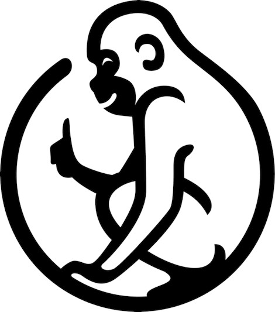

# Monkey Lang, implemented in Zig!



Monkey is a programming language built by hand, solely for educational purposes. If you are
interested in learning how to write a language
yourself, [please check out this link for more information.](https://monkeylang.org/)

## Features

Monkey includes:

* integers
* booleans
* strings
* functions as expressions (closures)
* if-else control flow
* implicit and explicit returns

## Build Instructions

First, you must install
Zig. [You can find instructions here.](https://ziglang.org/learn/getting-started/)

Next, run:

```
zig build install
``` 

This will compile the source code into an executable. It can
be found at `zig-out/bin/monkey-lang`. You can execute it in a terminal, and it will
launch into an interactive REPL. As a shortcut to compile and
launch into the REPL directly, run:

```
zig build run
```

If you want to use a file for your input, simply add a relative path to the file as a CLI argument:

```
zig-out/bin/monkey-lang input.txt
```

The same shortcut can be used for files:

```
zig build run -- input.txt
```

## Advanced Use Case

For user who want an improved user experience, you can link the GNU Readline library into the REPL
by adding the `-Denable_readline` flag:

```
zig build repl -Denable_readline
```

[You can find GNU Readline library instructions here.](https://tiswww.case.edu/php/chet/readline/rltop.html#Distributions)
